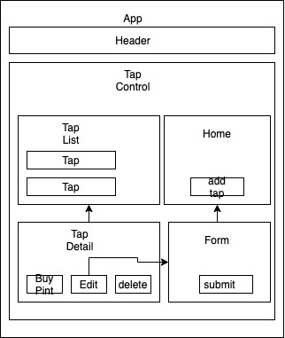

# Jesse's Tap Room

### By Jesse Callahan

## Description

This website allows you to create, edit, and delete taps. Look at a list of your taps and record bought pints. It uses REACT.js.

## Setup/Installation Requirements

  1. Clone this repository to your desktop
  2. Navigate to the top level of the directory
  3. npm run build && npm run start
  4. Enjoy!

## Flow Chart / Design

## Known Bugs

No known bugs at this time

## License

Copyright (c) Jesse Callahan 

This software is licensed under the MIT license

## Contact Information

jessetylercallahan@gmail.com>

## Technologies Used

* React
* HTML
* CSS
* JavaScript
